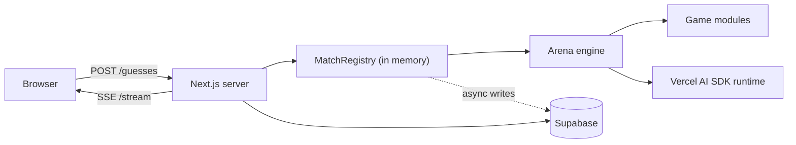

# Architecture

## The shape

One long-lived Node process serves the Next.js UI, the HTTP API, and the live
games. There is no worker and no queue.

The dotted edge is the important one: persistence is off the response path.

## Why it is built this way

The previous design used Postgres as an IPC bus between the web app and a
worker. Every interaction became table rows that both sides rediscovered by
polling — a 1000ms claim loop, a 500ms worker loop, and a 700ms browser loop
stacked on top of each other, plus a full event-history refetch twice a second.

The worker already held live game state in memory. It had no door. This design
adds the door and deletes the bus.

## Package boundaries

### Protocol

`@ai-ramp/protocol` holds anything that crosses a boundary: request schemas,
game actions, public state, event envelopes, manifests, and DTOs. It cannot
import React, Supabase, AI SDK providers, or game implementations.

### Engine

`@ai-ramp/engine` defines how orchestration talks to games, model players, and
event sinks, and provides `runAdapter` — the generic turn loop. It may retry or
time an action, but it must not understand a Wordle guess or a Codenames role.

### Games

Each game package owns its rules, word lists, prompts, adapter, match
definition, and scoring. A game module is runnable without Next.js, Supabase, or
a network.

### Storage and model runtime

`storage` adapts Supabase; `model-runtime` adapts the Vercel AI SDK. Neither
makes gameplay decisions.

### The live layer

`apps/web/lib/arena` is the composition root for live play:

| File | Owns |
| --- | --- |
| `registry.ts` | The `gameId → LiveGame` map, admission control, idle eviction, expiry sweep, SIGTERM drain |
| `live-wordle.ts` | One game: model boards, the human board, subscribers, rehydration |
| `views.ts` | Projection to a client — the one place concealment is decided |
| `persist/wordle.ts` | Batched turn writes, off the response path |

## Human seats are not model players

In the old design the human was a fake async `ModelPlayer` blocked inside
`runAdapter`, waiting on a database row. A human guess is genuinely
request/response, so the human's board is now a plain `WordleModel` that the
guess route calls directly.

Three things fall out of that:

- Rehydration is trivial, because nothing is suspended mid-loop.
- No promise dangles waiting for a player who closed the tab.
- The "three invalid guesses abandons the match" rule in `runAdapter` — correct
  for a model emitting malformed output, disastrous for a human typo — cannot
  reach a person at all.

That last one still needs solving generically before Codenames and Imposter get
human seats again.

## Concealment

Game definitions publish canonical state with real letters. Every client-facing
path goes through `toSeatView` in `lib/arena/views.ts`, which blanks model
letters until the human's board is over. One function to audit, rather than one
per route.

The answer itself lives in `wordle_games.answer` and in `LiveWordleGame`, and is
attached to a response only when `revealed` is true.

## Lifecycle

1. `POST /api/games` picks an answer, writes the game, and starts the model
   boards. The response carries no answer.
2. Model boards race in parallel and finish in roughly 10–15 seconds.
3. The human plays over `POST /guesses`, one round trip per guess.
4. When the human's board ends, everything unseals. When both sides have
   settled, the game completes.
5. Quitting forfeits the human participant and leaves the models running.
6. Anything unfinished after 24 hours is swept and auto-forfeited.

## Deliberately not done yet

No model gateway: there is no per-provider rate limiting, no per-call timeout,
and no circuit breaker. A hung provider currently stalls a game's model boards
indefinitely. The six configured providers shard the load across six separate
quota pools, which is the only thing holding the burst together today.
