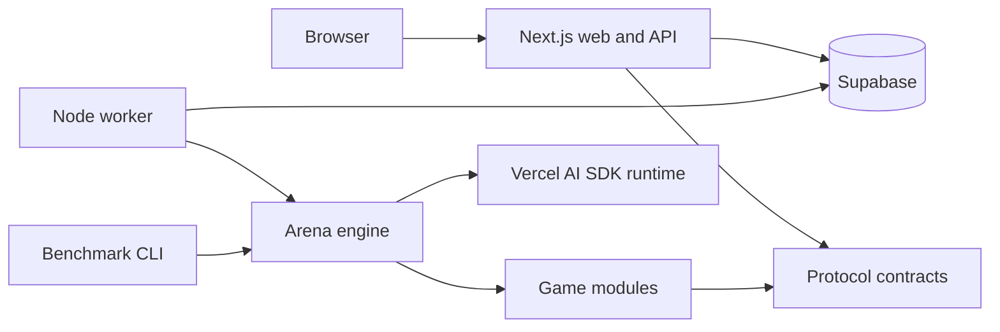

# Architecture

## Product shape

The arena has one set of game rules and two execution paths:

1. **Play:** Next.js creates a room/run, Supabase stores coordination state, and
   a long-running worker alternates between model and human actions.
2. **Benchmark:** the CLI calls the same game definitions and model runtime
   directly, persisting events to Supabase when configured.

The frontend renders public events. It never runs a game model or receives
canonical secret state.

## Package boundaries

### Protocol

`@ai-ramp/protocol` contains data that may cross a process boundary: request
schemas, game actions, public state, event envelopes, manifests, and run DTOs.
It cannot import React, Supabase, AI SDK providers, or game implementations.

### Engine

`@ai-ramp/engine` defines how orchestration talks to games, model players,
interactive humans, events, and storage. Generic code may retry or time actions,
but it must not understand Wordle guesses or Codenames roles.

### Games

Each game package owns pure rules, canonical serialization, prompts, the adapter,
match structure, scoring, and visibility policy. This keeps game-specific changes
inside one teammate-owned package.

### Model runtime and storage

`model-runtime` adapts Vercel AI SDK models to `ModelPlayer`. `storage` adapts
Supabase to `ArenaRepository`. Neither owns gameplay decisions.

### Applications

Applications are composition roots. They select concrete games, storage, and
model providers, but should contain little reusable domain logic.

## Intended play lifecycle

1. The API validates a play request and creates a participant plus run/room.
2. A ready run enters the queue; Codenames waits in a lobby for both humans.
3. The worker claims the run and asks its game definition to execute a match.
4. The definition requests either a model decision or a durable human action.
5. Every meaningful transition becomes an ordered, audience-tagged event.
6. The browser polls events by cursor and rebuilds a game-specific view.

Canonical state remains server-side. Public state is always projected by the
owning game adapter for a spectator or seat.

## Intentional omissions

The wireframe does not choose queue retry policy, Elo details, provider settings,
or Imposter rules. Those decisions should be made in the workstream that owns the
behavior and reflected in protocol only when data must cross a boundary.
